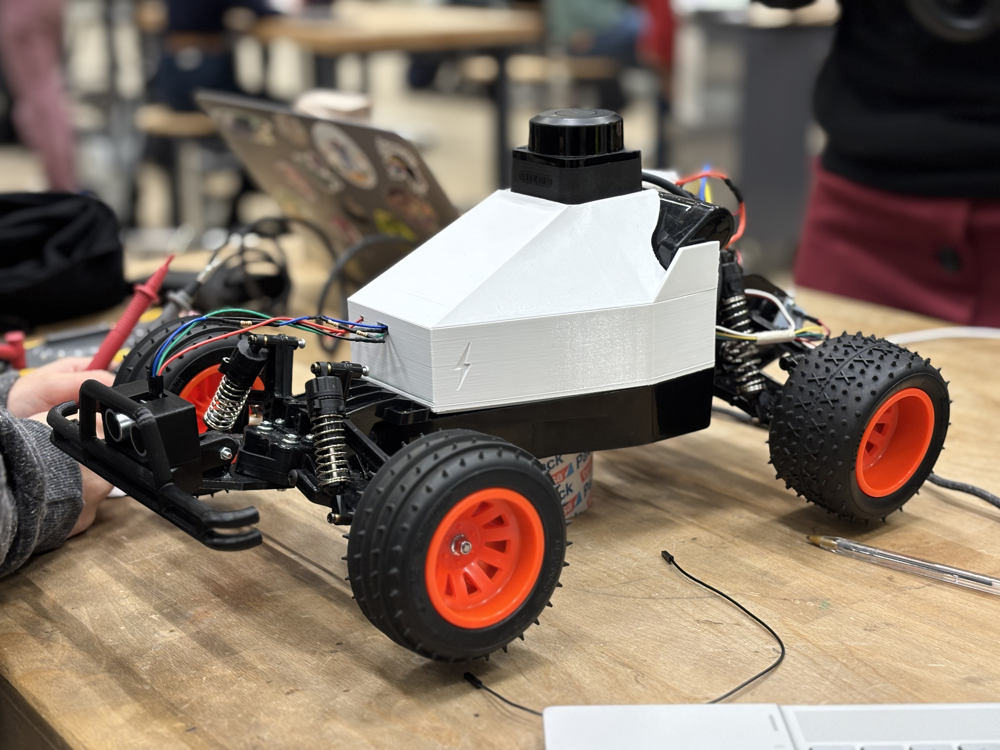

# SLAMaleykoum

> An autonomous mobile robot that transforms an RC car into an intelligent mapping and navigation platform using dual ESP32-S3 microcontrollers.

<p align="center">
  <video width="500" controls>
    <source src="assets/Demo/DLLEL_run_19-dec-2025.mp4" type="video/mp4">
  </video>
</p>

<p align="center">
  <video width="500" controls>
    
  </video>
</p>


## Project Context


---

## Detailed Documentation

For in-depth technical details, refer to the dedicated subsystem documentation:

<table>
<tr>
<td width="33%" align="center">

### 🔧 **[Hardware: Step by Step How to build](assets/docs/hardware/ASSEMBLE_GUIDE.md)**

Assembly instructions, wiring diagrams, CAD files, component specs

</td>
<td width="33%" align="center">

### 🗺️ **[ESP-1: Mapping & Planning](include/esp1/README.md)**

LiDAR processing, Bayesian mapping, frontier detection, A* path planning

</td>
<td width="33%" align="center">

### 🎮 **[ESP-2: Control & Localization](include/esp2/README.md)**

Sensor fusion, Pure Pursuit control, motor management, safety systems

</td>
</tr>
</table>

---

**Context:**

This project was developed as part of the [**Making Intelligent Things** (CS-358)](https://edu.epfl.ch/coursebook/en/making-intelligent-things-a-CS-358-A) course at **EPFL** (École Polytechnique Fédérale de Lausanne).

**Acknowledgments:**
- Built upon the foundation of **TurboSLAM** (previous team)
- Course instructors and TAs for guidance and support

---

## Table of Contents

1. [Project Overview](#project-overview)
2. [Quick Start](#quick-start)
3. [Hardware](#hardware)
4. [System Architecture](#system-architecture)
5. [Software Setup](#software-setup)
6. [Configuration & Tuning](#configuration--tuning)
7. [Documentation Index](#documentation-index)
8. [Archives](#archives)

---

## Project Overview

### Vision

SLAMaleykoum is an autonomous robotics platform that transforms a standard RC car chassis into an intelligent mobile robot capable of mapping and navigating unknown environments. The system performs full Simultaneous Localization and Mapping (SLAM), enabling the robot to autonomously explore, build a map, localize itself with high accuracy in real time, navigate to target coordinates, dynamically avoid obstacles, and maintain a reliable estimate of its position throughout the mission.

Here is our original [Project proposal](https://www.overleaf.com/9942875199zgzbkrmgkkkj#3fbbb2) for our SLAM Car. Please note that it represents the initial version of the project. Since then, many aspects have evolved and changed throughout development, so the proposal should be considered an early-stage reference rather than the final design.

### Technical Vocabulary
- Ground Station: **GS** _referring to the laptop or some other computer external to the car._

### Key Objectives
- **Autonomous Mapping**: Create detailed environment maps using LiDAR sensor data
- **Robust Localization**: Maintain accurate pose estimation through sensor fusion
- **Intelligent Navigation**: Plan and execute collision-free paths to destinations
- **Real-time Control**: Execute precise motor control for path following
- **Remote Monitoring**: Provide ground station (GS) visualization

> **Important**: The car should be able to operate fully autonomously -> with **no** GS.
> No computations nor storage will be offloaded to the GS. 

### Core Technologies
- **Hardware**: Dual ESP32-S3 microcontrollers, LiDAR sensor, wheel encoders, IMU
- **Operating System**: FreeRTOS for real-time multitasking
- **Communication**: UART (inter-processor), TCP (ground station)
- **Algorithms**: A* pathfinding, Pure-Pursuit controller, Bresenham for mapping, BFS for frontier clustering

### System at a Glance

```
┌─────────────────────────────────────────────────────────┐
│  ESP-1: Mapping & Planning (1-10 Hz)                    │
│  • LiDAR processing & Bayesian mapping                  │
│  • Frontier detection & clustering                      │
│  • A* global path planning                              │
│  • Ground station telemetry (WiFi/TCP)                  │
└─────────────────────────────────────────────────────────┘
                         ↕ UART
┌─────────────────────────────────────────────────────────┐
│  ESP-2: Localization & Control (50-100 Hz)              │
│  • Sensor fusion (encoder + IMU)                        │
│  • Pure Pursuit path following                          │
│  • Motor & steering control                             │
│  • Emergency obstacle handling                          │
└─────────────────────────────────────────────────────────┘
```

---

## Quick Start

### Prerequisites Checklist

**Hardware:**
- Assembled robot (see [Hardware section](#hardware))
- 7.2V NiMH battery (charged)
- USB cables for flashing ESP32s
- Computer with WiFi capability

**Software:**
- Python 3.8+ ([download](https://www.python.org/downloads/))
- PlatformIO Core or VS Code extension ([install guide](https://docs.platformio.org/en/latest/core/index.html))

### Flash & Run (30 minutes)

**Step 1: Install Ground Station Dependencies**
```bash
# Create virtual environment
python3 -m venv slamaleykoum_venv

# Activate environment
source slamaleykoum_venv/bin/activate  # On Windows: slamaleykoum_venv\Scripts\activate

# Install dependencies
pip install -r requirements.txt
```

**Step 2: Flash ESP32 Firmware**

This project uses two ESP32s. You must flash them individually.

```bash
# In VS Code with PlatformIO extension:
# 1. Connect ESP1 via USB (use RIGHT port - left port may not work)
# 2. Open PlatformIO extension (alien icon)
# 3. Click esp1/General/Upload
# 4. Wait for upload to complete
# 5. Repeat for ESP2: Connect ESP2 → esp2/General/Upload
```

**Step 3: Power Up & Connect**

1. **Power sequence:**
   ```
   Battery → ESC → Turn ESC switch ON
   ```
   ⚠️ **WARNING**: When disconnecting, first turn the ESC off, then disconnect the battery.

2. **Connect to robot WiFi:**
   - **SSID:** `LIDAR_AP`
   - **Password:** `l1darpass`

3. **Launch ground station:**
   ```bash
   # Ensure your venv is active
   source slamaleykoum_venv/bin/activate
   
   # Run the interface
   python ground_station.py
   ```
   A *Pygame* window will appear. Press **START** to begin logging data and visualizing the real-time LIDAR feed.

**What to expect:**
- Ground station shows live LiDAR scan
- Robot begins mapping and moving toward frontiers
- Map builds progressively as robot explores

**First-time issues?** → Check out [Troubleshooting guide](assets/docs/troubleshooting.md)

> *Dev Note: To change WiFi credentials, modify [`src/esp1/main_esp1.cpp`](src/esp1/main_esp1.cpp) before flashing.*

---

## Hardware

### Component List

| Component                              | Reference Links                                                                                                                                                                                                 | Price (CHF) |
|----------------------------------------|-----------------------------------------------------------------------------------------------------------------------------------------------------------------------------------------------------------------|-------------|
| Tamiya Blitzer Beetle                  | [Manual](https://www.tamiyausa.com/media/files/58502ml-829-5367.pdf)                                                                                                                                             | 129.00      |
| RPLIDAR C1                             | [Datasheet](https://d229kd5ey79jzj.cloudfront.net/3157/SLAMTEC_rplidar_datasheet_C1_v1.0_en.pdf), [SDK](https://github.com/Slamtec/rplidar_sdk), [Wiki](https://www.waveshare.com/wiki/RPLIDAR_C1)              | 79.90       |
| ESP32-S3-WROOM-1 Microcontroller (x2)  | [Datasheet](https://cdn-shop.adafruit.com/product-files/5477/esp32-s3_datasheet_en.pdf)                                                                                                                         | 50.90       |
| DMS15 Servo                            | [Wiki](https://wiki.dfrobot.com/DSS-M15S_270%C2%B0_15KG_DF_Metal_Servo_with_Analog_Feedback_SKU__SER0044)                                                                                                         | 5.00        |
| BNO086 IMU                             | [Datasheet](https://docs.sparkfun.com/SparkFun_VR_IMU_Breakout_BNO086_QWIIC/assets/component_documentation/BNO080_085-Datasheet_v1.16.pdf)                                                                      | 19.90       |
| AS5600 Encoder                         | [Datasheet](https://files.seeedstudio.com/wiki/Grove-12-bit-Magnetic-Rotary-Position-Sensor-AS5600/res/Magnetic%20Rotary%20Position%20Sensor%20AS5600%20Datasheet.pdf)                                          | 2.00        |
| HC-SR04 Ultrasonic Sensor              | [Datasheet](https://handsontec.com/dataspecs/sensor/SR-04-Ultrasonic.pdf)                                                                                                                                       | 2.00        |
| 540J Motor                             | [Datasheet](https://asset.conrad.com/media10/add/160267/c1/-/en/001385115DS01/adatlap-1385115-540-es-motor-reely-532114c.pdf)                                                                                   | —           |
| THW-1060-RTR ESC                       | [Datasheet](https://www.hobbywing.com/en/uploads/file/20221015/f60b7ebe160a7b283927ae8916d36763.pdf)                                                                                                            | —           |
| LM2596 Buck Converter                  | [Datasheet](https://www.ti.com/lit/ds/symlink/lm2596.pdf)                                                                                                                                                       | —           |
| 7.2V Battery                           | [Product Page](https://www.galaxus.ch/fr/s5/product/gens-ace-modelisme-dune-batterie-720-v-5000-mah-batterie-rc-9459930)                                                                                        | 32.90       |
| **Total Cost**                         |                                                                                                                                                                                                                 | **321.60**  |

**Additional materials needed:**
- $3 \times 1 K\Omega$ resistors (for the ultrasonic sensor voltage divider)
- Assorted jumper cables and connectors (male/female)
- Heat-shrink tubing or insulation sleeves
- Soldering kit (soldering iron, solder wire)
- Hot air/heat gun (for shrinking tubing)
- Screw set (M3 and M6 as used in mounts)

### Assembly Overview

The robot is built on a Tamiya Blitzer Beetle chassis with custom 3D-printed mounts for the LiDAR, ESP32 boards, encoder, ultrasonic sensor, and battery. Assembly is straightforward: build the base chassis, install the encoder and magnet on the motor shaft, mount the electronics platform, attach the sensors, and finish with wiring.

**Assembly phases:**
1. **Chassis** (30 min) - Build base chassis & install motor/encoder
2. **3D-printed mounts** (10 min) - Install LiDAR platform, ESP32 holders, sensor brackets
3. **Electronics mounting** (20 min) - Secure ESPs, buck converter, IMU
4. **Wiring** (60 min) - Follow electrical diagram, install voltage divider
5. **Final assembly** (30 min) - Install battery, route cables, verify connections

**📘 Full step-by-step assembly guide (with photos, CAD files, wiring diagrams):**  
→ [**Complete Assembly Instructions**](/assets/docs/hardware/ASSEMBLE_GUIDE.md)

### Wiring & Electrical

**Electrical Diagram:**

<p align="center">
  
</p>

**⚠️ Important Wiring Notes (Do Not Skip)**

- **Common Ground**: All components (ESP32s, ESC, sensors, servo) must share a common ground from the buck converter.

- **5V vs 3.3V Power**:
  - ESP32 boards, ultrasonic sensor, lidar, and servo are powered from 5V (buck converter)
  - IMU and encoder are powered from ESP2's 3.3V pin

- **Ultrasonic Sensor (HC-SR04) → Voltage Divider Required**
  - The HC-SR04 ECHO pin outputs 5V
  - ESP32 GPIOs are 3.3V-only
  - A resistor voltage divider is mandatory on the ECHO line
  - Connecting ECHO directly to the ESP32 will damage the GPIO

- **ESP-to-ESP Communication**: UART cross-connection is required (TX ↔ RX between ESP1 and ESP2).

**📘 Detailed Wiring & Soldering Guide:**  
→ [**Full wiring explanation**](/assets/docs/hardware/circuit/README.md)

### CAD Files

You can explore all STL files directly in the [**CAD folder**](/assets/CAD).

Here is a quick video of the car's body and roof: [**CAD Video**](/assets/docs/hardware/CAD/fast_cad_video.mp4)

<p align="center">
  <video width="500" controls>
    <source src="assets/docs/hardware/CAD/fast_cad_video.mp4" type="video/mp4">
  </video>
</p>

**Note:** The CAD files for the **front bumper**, **ultrasonic sensor case**, and **encoder mount** were originally designed by the group from whom we inherited the car, [**TurboSLAM**](https://github.com/epfl-cs358/2025sp-turboslam).

**Before implementing the hardware setup**, check the [Problems and Recommendations](assets/docs/troubleshooting.md) section (Hardware parts) to get a full scope of what may need to be modified.

---

## System Architecture

The computational load is divided over the two ESP32-S3 microcontrollers. The first one takes care of the mapping & global planning, while the second one takes care of localization & control of the vehicle. We run **FreeRTOS** to take care of our parallelism and we are communicating between our two ESPs via **UART** (via the serial ports).

**Rationale:**

1. **Performance**: Each processor can focus on its task without competing for resources
2. **Modularity**: Components are well-isolated, making testing and debugging easier
3. **Reliability**: Control loop continues operating even if global planning encounters issues
4. **Efficiency**: Only essential data is sent from one ESP to the other, limiting the flow of information.

*Note: For each ESP we've got a dedicated README file delving into more details. They can be found in [`include/esp1/README.md`](include/esp1/README.md) and [`include/esp2/README.md`](include/esp2/README.md)*

### Architecture Diagrams

**ESP-1 System Diagram:**


**ESP-2 System Diagram:**


### ESP-1: Mapping & Planning

🦄 **[Full ESP-1 Documentation →](include/esp1/README.md)**

**Primary Mission**: Create and maintain a global understanding of the environment and plan high-level navigation strategies.

**Core Responsibilities**:
- Generate and maintain occupancy grid maps using Bayesian updates
- Find the frontier cells to explore and cluster them using BFS algorithms
- Define a temporary goal for the car to reach
- Plan global paths using A* algorithm
- Share telemetry with ground station via WiFi (visualization purposes)
- Send the computed path to ESP2

**Key Components:**
- **LiDAR Processing**: Extract and convert RPLIDARC1 data into readable scans
- **Bayesian Grid Mapping**: Build persistent 2D occupancy grid from LiDAR data
- **Mission Planner**: Select exploration goals based on frontier detection
- **Global Planner (A*)**: Compute collision-free paths on the grid

### ESP-2: Localization & Control

🦄 **[Full ESP-2 Documentation →](include/esp2/README.md)**

**Primary Mission**: Execute precise vehicle control and maintain high-frequency local pose tracking.

**Core Responsibilities**:
- Execute Pure Pursuit path following algorithm
- Handle emergency stop commands and maneuvers to escape when stuck
- Aggregate sensor data (odometry, IMU) to follow the position of the car and forward to ESP-1

**Key Components:**
- **Sensor Fusion**: Combine encoder + IMU for pose estimation
- **Pure Pursuit Controller**: Local path-tracking with bicycle model
- **Motor Control**: ESC PWM control with emergency stop
- **Safety System**: Ultrasonic-based obstacle detection
- **Recovery Maneuvers**: Automated escape sequences when blocked

### Communication Architecture

#### Inter-ESP Communication (UART)

**Protocol**: Custom packet-based with checksums

**Data Flow:**

| Direction | Message Type | Content |
|-----------|--------------|---------|
| ESP2 → ESP1 | `Pose2D` | Current robot pose (x, y, θ) |
| ESP1 → ESP2 | `PathMessage` | Global path waypoints |


👉 **[Full ESP Link Protocol Documentation →](include/common/esp_link_readme.md)**

#### Ground Station Communication (WiFi/TCP)

**WiFi Mode**: Access Point (AP)
```
SSID:     LIDAR_AP
Password: l1darpass
```

**ESP-1 → Ground Station**:
- Real-time map visualization data
- Mission status: goal and state
- Robot pose and trajectory
- Telemetry

The ESP creates a Wi-Fi access point (AP) that we connect to for **monitoring purposes only**. We used MQTT at first to get feedback during tests, but quickly switched to TCP, as it supports higher data throughput.

If you want to establish the same MQTT connection to debug, here is the guide to follow: [**WiFi and MQTT connection guide**](/assets/docs/WiFi_and_MQTT_Connection_Guide___SLAMaleykoum.pdf).

### Shared Mechanisms (`common/`)

- `data_types.h`: Definitions of shared data structures
- `esp_link.h`: The communication system from one ESP to the other. [→ ESP Link README](include/common/esp_link_readme.md)
- `transforms.h`: Functions that transform the position of the robot to the grid and the other way around. [→ Transforms README](include/common/transforms_readme.md)
- `utils.h`: Regroups the functions used across different files to avoid redefining it.
- `wifi_connection.h`: Protocol to connect the WiFi for MQTT

---

## Software Setup

### Development Environment

**Prerequisites:**
* [Python 3.8+](https://www.python.org/downloads/)
* [PlatformIO Core](https://docs.platformio.org/en/latest/core/index.html) or VS Code extension

### Project Structure
```
SLAMaleykoum/
├── include/                    # Header files
│   ├── common/                 # Shared utilities & communication
│   ├── esp1/                   # Mapping & Planning headers
│   └── esp2/                   # Localization & Control headers
│
├── src/                        # Implementation files
│   ├── common/                 # Shared utilities
│   ├── esp1/                   # ESP-1 source code
│   └── esp2/                   # ESP-2 source code
│
├── assets/                     # Documentation & media
│   ├── Demo/                   # Demo videos
│   ├── Images/                 # Photos & diagrams
│   └── docs/                   # Technical documentation
│       ├── hardware/           # Assembly guide, CAD files, wiring
│       ├── esp1/               # Architecture diagrams
│       └── esp2/               # Architecture diagrams
│
├── archives/                   # Historical deprecated implementations
│
├── README.md
├── requirements.txt            # Set up python requirements
├── ground_station.py           # Visualization & telemetry
├── platformio.ini              # Build configuration
└── boards/                     # Custom board definitions
```

**Key Directories:**
- `include/` + `src/` - Dual-ESP codebase organized by subsystem
- `assets/` - All documentation, images, and demo videos
- `archives/` - Previous implementations and test code

### Ground Station (PC)

The ground station script runs on your computer to visualize telemetry.  
*Note: We recommend using a virtual environment.*

Install the dependencies from our `requirements.txt` file.

```bash
# Create virtual environment
python3 -m venv slamaleykoum_venv

# Activate environment
source slamaleykoum_venv/bin/activate  # On Windows: slamaleykoum_venv\Scripts\activate

# Install dependencies
pip install -r requirements.txt
```

### Firmware (ESP32s)

This project uses two ESP32s. You must flash them individually.

**Upload Code:**

Open in PlatformIO: Open the project folder in VS Code.

1. Connect to the ESP1 via USB.
2. Open the *platformio* extension in VS Code (the alien logo).
3. Click on `esp1/General/Upload`.
4. Repeat for the ESP2: Connect ESP2 → `esp2/General/Upload`.

**⚠️ Important:** Use the **RIGHT USB port** on each ESP32. Left ports don't seem to work for programming.
*Note: In our design, the esp1 is upside down, so the right port is the one on the left looking from the outside of the car.*

### WiFi Configuration

**Default credentials** (edit before flashing if needed):
```cpp
#define WIFI_SSID "LIDAR_AP"
#define WIFI_PASSWORD "l1darpass"
```

---

## Configuration & Tuning

### Map Parameters

Configure the mapping grid size and resolution:

```cpp
// src/esp1/main_esp1.cpp
#define GRID_SIZE_X 70      // cells
#define GRID_SIZE_Y 70      // cells
#define RESOLUTION 0.2      // meters/cell <- This is the most important parameter.
                            // It directly affects the size of the grid.
```

**Physical map size:** 14m × 14m (with 0.2m resolution)
**Memory usage:** 70 × 70 × 1 byte = 4.9 KB

**⚠️ Important:** Grid dimensions **must match** in [`ground_station.py`](ground_station.py):
```python
GRID_SIZE_X = 70
GRID_SIZE_Y = 70
RESOLUTION = 0.2
```

**Trade-offs:**
- Larger `RESOLUTION` → bigger mapping area → less detail
- Smaller `RESOLUTION` → smaller mapping area → more detail
- Larger grid → more detail, more memory, slower updates
- Smaller grid → less detail, faster, but limited range

### Control Parameters

```cpp
// include/esp2/control/pure_pursuit.h
#define LOOKAHEAD_DISTANCE 0.3   // meters
#define TARGET_SPEED 0.2         // m/s
#define WAYPOINT_THRESHOLD 0.1   // meters
#define MAX_STEERING_ANGLE 30    // degrees
```

**Tuning guide:**
- `LOOKAHEAD_DISTANCE`:
  - Too small → oscillation, sharp turns
  - Too large → cuts corners, misses waypoints
- `TARGET_SPEED`:
  - Higher → faster exploration, worse odometry, worse mapping
  - Lower → accurate mapping, slow mission

### Sensor Parameters

```cpp
// include/esp2/hardware/encoder.h
#define ENCODER_TICKS_PER_REV 4096
#define GEAR_RATIO 10.0
#define WHEEL_RADIUS 0.032       // meters

// include/esp2/hardware/imu.h
#define IMU_SAMPLE_RATE 100      // Hz
#define YAW_STABILITY_THRESHOLD 15  // degrees

// include/esp2/hardware/ultrasonic.h
#define EMERGENCY_THRESHOLD 0.2  // meters
#define ULTRASONIC_TIMEOUT 30    // ms
```

### FreeRTOS Task Priorities

```cpp
// ESP-1
Lidar_Read_Task:       Priority 4, Core 1, Stack 3072
Lidar_Sync_Map_Task:   Priority 4, Core 1, Stack 8192
Bayesian_Grid_Task:    Priority 3, Core 1, Stack 20480
IPC_Receive_Task:      Priority 3, Core 0, Stack 2048
TCP_Transmit_Task:     Priority 1, Core 0, Stack 8192
Mission_Planner_Task:  Priority 2, Core 0, Stack 4096
Global_Planner_Task:   Priority 2, Core 0, Stack 8192

// ESP-2
TaskReceivePath:       Priority 3, Core 0, Stack 6144
TaskOdometryUnified:   Priority 3, Core 0, Stack 10240
TaskMotor:             Priority 2, Core 1, Stack 6144
TaskUltrasonic:        Priority 2, Core 1, Stack 6144
TaskPurePursuit:       Priority 1, Core 1, Stack 6144
```

---

## Documentation Index

### Core System Documentation

**Main System:**
- [Main README](README.md) - This document
- [Project Proposal](https://www.overleaf.com/9942875199zgzbkrmgkkkj#3fbbb2) - Original project vision

**ESP Subsystems:**
- [ESP-1: Mapping & Planning](include/esp1/README.md)
- [ESP-2: Localization & Control](include/esp2/README.md)

### Software Documentation
- [ESP-1: Mapping & Planning](include/esp1/README.md)
- [ESP-2: Localization & Control](include/esp2/README.md)
- [Pure Pursuit Controller](include/esp2/control/pure_pursuit_readme.md)

### Hardware Documentation

**Assembly & Build:**
- [Complete Assembly Guide](/assets/docs/hardware/ASSEMBLE_GUIDE.md)
- [Wiring & Circuit Details](/assets/docs/hardware/circuit/README.md)

**Shared Utilities:**
- [ESP Link Protocol](include/common/esp_link_readme.md)
- [Coordinate Transforms](include/common/transforms_readme.md)

### Configuration & Setup

- [WiFi & MQTT Setup Guide](/assets/docs/WiFi_and_MQTT_Connection_Guide___SLAMaleykoum.pdf)

---

## Archives

The purpose of this directory is to save our previous work, and keep track of the tests we made.

### Previous Work

We tried many things that were eventually not used. These can be found in the subdirectories of `esp1` and `esp2`.

#### `esp1`
- `rpLidar` (and `rpLidarTypes`) contains the full KKest library as found on GitHub. While we kept the same underlying implementation, we simplified it in our codebase to reduce memory usage. The original version is kept here for reference.

#### `esp2`
- `motor_pid` was ultimately not functional due to the poor quality of the ESC we used.
- `ekf_localizer` was not used because the IMU was not accurate enough for acceleration_y and acceleration_x so the computation of the position using IMU was unreliable.
- `pure_pursuit` is used in the project, but the archived files contain earlier implementations based on EKF and PID control. We kept the full version here for reference, while a cleaned and correct implementation is used in the main code.
- `recovery_maneuver` turned the car toward the first waypoint of a path. Not used due to delays with new paths; current version does an automatic 180° turn for reliability. We kept this improved version in the archive.

### The Tests

Some tests are no longer directly runnable without modifications, as data types evolved over time and the include paths differ from the current project structure.

There is one test directory per ESP, containing all the tests developed throughout the project. Some tests target specific components, while others exercise the full system.

To avoid redefining the same constants and parameters in every test, two shared files are used:
`test_common_esp<i>` contains constants and the prototypes of the setup and loop functions, and `test_globals_esp<i>` defines and initializes global variables.

Each test entry point is implemented in `test_main_esp<i>`, which simply includes these shared files. In the setup and loop functions of the test main, the test to run is selected via a test ID.

The Python files are used for TCP monitoring and for displaying the received data in a structured format.

---

## Credits

### Project Team

SLAMaleykoum was developed as an autonomous robotics project, building on the foundation laid by the [**TurboSLAM**](https://github.com/epfl-cs358/2025sp-turboslam) team who designed the original elecrical circuit, encoder mount, and ultrasonic sensor case.

### Key Technologies & Libraries

- **FreeRTOS** - Real-time operating system for multitasking
- **Rob Tillaart's AS5600 library** - Magnetic encoder reading
- **RPLIDAR C1 SDK** - Slamtec's LiDAR interface
- **PlatformIO** - Development platform for ESP32
- **Python + Pygame** - Ground station visualization

### Hardware Credits

- **Tamiya Blitzer Beetle** - RC car chassis platform
- **TurboSLAM Team** - Original CAD designs for bumper, ultrasonic case, and encoder mount

---

## Conclusion

SLAMaleykoum demonstrates the transformation of a standard RC car into a fully autonomous robot capable of real-time mapping, localization, and navigation. By distributing computation across two ESP32-S3 microcontrollers and leveraging FreeRTOS, the system achieves a robust, modular, and fully self-contained architecture.

The project involved addressing multiple hardware and software challenges, leading to practical design choices and algorithmic optimizations suited to embedded constraints. Overall, SLAMaleykoum provides a solid foundation for future improvements and stands as a complete and extensible SLAM platform for autonomous robotics on resource-limited hardware.

---

**Questions? Issues? Feedback?**

For technical support or to report issues, please refer to the [Troubleshooting](assets/docs/troubleshooting.md) section first. For further assistance, consult the detailed component documentation in the [Documentation Index](#documentation-index).