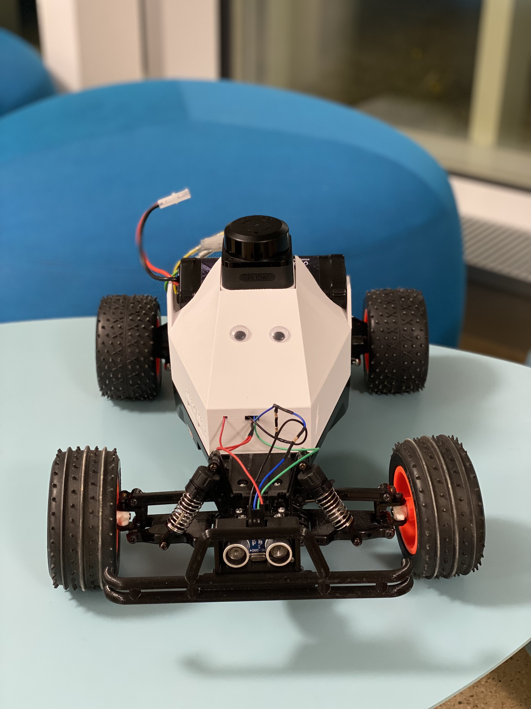
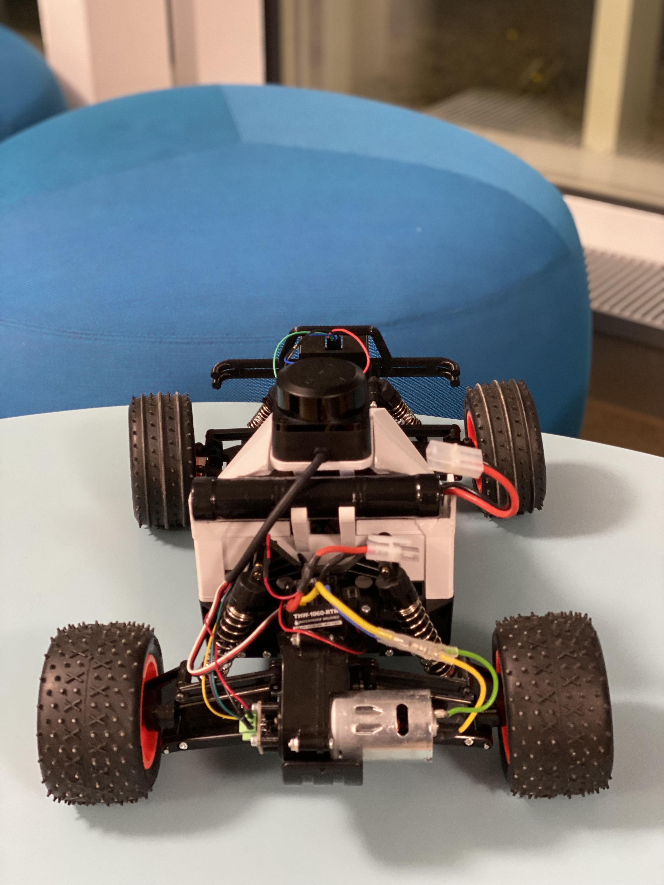

# SLAMaleykoum

## Table of Contents
1. [Project Overview](#project-overview)
2. [Hardware Overview](#hardware-overview)
3. [System Architecture](#system-architecture)
4. [Data Flow and Communication](#data-flow-and-communication)
5. [Set it up](#set-it-up)
6. [Usage and Operation](#usage-and-operation)
7. [Troubleshooting](#troubleshooting)
8. [Problems and Recommendations](#problems-and-recommendations)
9. [Archives](#archives)
10. [Conclusion](#conclusion)

---

## Project Overview

### Vision
SLAMaleykoum is an autonomous robotics platform that transforms a standard RC car chassis into an intelligent mobile robot capable of mapping and navigating unknown environments. The system performs full Simultaneous Localization and Mapping (SLAM), enabling the robot to autonomously explore, build a map, localize itself with high accuracy in real time, navigate to target coordinates, dynamically avoid obstacles, and maintain a reliable estimate of its position throughout the mission.

Here is our original [Project proposal](https://www.overleaf.com/9942875199zgzbkrmgkkkj#3fbbb2) for our SLAM Car. Please note that it represents the initial version of the project. Since then, many aspects have evolved and changed throughout development, so the proposal should be considered an early-stage reference rather than the final design.


### Technical Vocabulary
- Ground Station: **GS**  _refering to the laptop or some other computer external to the car._


### Key Objectives
- **Autonomous Mapping**: Create detailed environment maps using LiDAR sensor data
- **Robust Localization**: Maintain accurate pose estimation through sensor fusion
- **Intelligent Navigation**: Plan and execute collision-free paths to destinations
- **Real-time Control**: Execute precise motor control for path following
- **Remote Monitoring**: Provide ground station (GS) visualization
> **Important**: The car should be able to opperate fully autonomously -> with **no** GS.
> No computations nor storage will be offloaded to the GS. 

### Core Technologies
- **Hardware**: Dual ESP32-S3 microcontrollers, LiDAR sensor, wheel encoders, IMU
- **Operating System**: FreeRTOS for real-time multitasking
- **Communication**: UART (inter-processor), TCP (ground station)
- **Algorithms**: A* pathfinding, Pure-Pursuit controller, Bresenham for mapping, BFS for frontier clustering

## Hardware Overview

### Component List
| Component                              | Reference Links                                                                                                                                                                                                 | Price (CHF) |
|----------------------------------------|-----------------------------------------------------------------------------------------------------------------------------------------------------------------------------------------------------------------|-------------|
| Tamiya Blitzer Beetle                  | [Manual](https://www.tamiyausa.com/media/files/58502ml-829-5367.pdf)                                                                                                                                             | 129.00      |
| RPLIDAR C1                             | [Datasheet](https://d229kd5ey79jzj.cloudfront.net/3157/SLAMTEC_rplidar_datasheet_C1_v1.0_en.pdf), [SDK](https://github.com/Slamtec/rplidar_sdk), [Wiki](https://www.waveshare.com/wiki/RPLIDAR_C1)              | 79.90       |
| ESP32-S3-WROOM-1 Microcontroller (x2)  | [Datasheet](https://cdn-shop.adafruit.com/product-files/5477/esp32-s3_datasheet_en.pdf)                                                                                                                         | 50.90       |
| DMS15 Servo                            | [Wiki](https://wiki.dfrobot.com/DSS-M15S_270%C2%B0_15KG_DF_Metal_Servo_with_Analog_Feedback_SKU__SER0044)                                                                                                         | 5.00        |
| BNO086 IMU                             | [Datasheet](https://docs.sparkfun.com/SparkFun_VR_IMU_Breakout_BNO086_QWIIC/assets/component_documentation/BNO080_085-Datasheet_v1.16.pdf)                                                                      | 19.90       |
| AS5600 Encoder                         | [Datasheet](https://files.seeedstudio.com/wiki/Grove-12-bit-Magnetic-Rotary-Position-Sensor-AS5600/res/Magnetic%20Rotary%20Position%20Sensor%20AS5600%20Datasheet.pdf)                                          | 2.00        |
| HC-SR04 Ultrasonic Sensor              | [Datasheet](https://handsontec.com/dataspecs/sensor/SR-04-Ultrasonic.pdf)                                                                                                                                       | 2.00        |
| 540J Motor                             | [Datasheet](https://asset.conrad.com/media10/add/160267/c1/-/en/001385115DS01/adatlap-1385115-540-es-motor-reely-532114c.pdf)                                                                                   | —           |
| THW-1060-RTR ESC                       | [Datasheet](https://www.hobbywing.com/en/uploads/file/20221015/f60b7ebe160a7b283927ae8916d36763.pdf)                                                                                                            | —           |
| LM2596 Buck Converter                  | [Datasheet](https://www.ti.com/lit/ds/symlink/lm2596.pdf)                                                                                                                                                       | —           |
| 7.2V Battery                           | [Product Page](https://www.galaxus.ch/fr/s5/product/gens-ace-modelisme-dune-batterie-720-v-5000-mah-batterie-rc-9459930)                                                                                        | 32.90       |
| **Total Cost**                         |                                                                                                                                                                                                                 | **321.60**  |


Alongside the listed components, you will also need:
- $3 \times 1 K\Omega$ resistors (for the ultrasonic sensor voltage divider)
- Assorted jumper cables and connectors (male/female)
- Heat‑shrink tubing or insulation sleeves
- Soldering kit (soldering iron, solder wire)
- Hot air/heat gun (for shrinking tubing)
- Screw set (M3 and M6 as used in mounts)


### How to Assemble

To begin, assemble the mechanical base of the car following the official [Tamiya Blitzer Beetle manual](https://www.tamiyausa.com/media/files/58502ml-829-5367.pdf).
We only need the minimal mechanical build so the car can drive, skip the decorative carcass.

**Step 1: Build the Car**  
- Assemble the chassis according to the manual.  
- Mount the steering servo inside the chassis.  
- Ensure the servo cables are routed through the rectangular opening so they can later connect to the ESP.  

<p align="center"></p>

**Step 2: Encoder Mount + Magnet**  
- 3D‑print the encoder mount (CAD file available in /assets/CAD/).  
- Attach the mount in front of the motor.  
- Fix the encoder magnet directly onto the motor shaft as shown in the provided image.  
- This ensures accurate rotation measurement.  
- Then screw down the encoder on its mount.

<p align="center"></p>

**Step 3: Layer Platform (ESP + Lidar Holder)**  
- Place the 3D‑printed platform on the chassis.  
- This platform integrates holders for both ESP boards and the lidar.  
- Screw the lidar onto its holder first (space is tight, so it’s easier to mount before other components).  
- Then screw down the buck converter and IMU onto their designated spots.  


<p align="center"></p>

**Step 4: Mount the ESP Boards**  
- Place ESP1 and ESP2 onto the platform.  
*Improovement note: mount both microcontrollers facing **upwards** so their LEDs and reset buttons are visible.*
- Our current ESP1 faces down, which hides the LEDs and complicates troubleshooting.  


<p align="center"></p>

**Step 5: Ultrasonic Sensor Mount**  
- Attach the front 3D‑printed piece designed for the ultrasonic sensor at the front of the car.  
- Screw the sensor securely into the mount.  

<p align="center"></p>
<p align="center"></p>

**Step 6: Final Assembly**  
- Place the hood/top of the car back on.  
- Insert the battery into its dedicated slot the hood design holds it firmly and stabilizes it during motion.  
- Double‑check that all mounts are secure and cables are routed cleanly for wiring.  

<p align="center"></p>
<p align="center"></p>
<p align="center"></p>


**Step 7: Wiring**  
- Once the mechanical build is complete, proceed to the [Soldering & Wiring](#soldering--wiring) section.  
- Follow the circuit [diagram](/assets/circuit/slamaleykoum_electrical_circuit.drawio.png) for all connections.  


<p align="center"></p>


### Soldering & Wiring

To build the robot from scratch, each component must be soldered and wired according to the electrical diagram.  
Use heat shrink tubing to insulate exposed connections and ensure long-term reliability.

**Electrical Diagram**

<p align="center">
  
</p>

**⚠️ Important Wiring Notes (Do Not Skip)**

- **Common Ground** : All components (ESP32s, ESC, sensors, servo) must share a common ground from the buck converter.

- **5V vs 3.3V Power** :

  - ESP32 boards, ultrasonic sensor, lidar, and servo are powered from 5V (buck converter)

  - IMU and encoder are powered from ESP2’s 3.3V pin

- **Ultrasonic Sensor (HC-SR04) ->  Voltage Divider Required**

  - The HC-SR04 ECHO pin outputs 5V

  - ESP32 GPIOs are 3.3V-only

  - A resistor voltage divider is mandatory on the ECHO line
  - Connecting ECHO directly to the ESP32 will damage the GPIO

- **ESP-to-ESP Communication** : UART cross-connection is required (TX ↔ RX between ESP1 and ESP2).

**Detailed Wiring & Soldering Guide**

For step-by-step soldering instructions, connector types, power distribution details, and close-up photos, see : [Detailed wiring explaination ](/assets/circuit/README.md)


### CAD Files

You can explore all STL files directly in the [CAD folder](/assets/CAD).  

This folder contains:
- STL files for every custom part
- Preview images of the CAD designs
For detailed descriptions, images, and design notes, see the dedicated CAD documentation: 
[CAD README](assets/CAD/README.md)

Here is a quick video of the car's body and roof : [CAD Video ](/assets/CAD/fast_cad_video.mp4)

<p align="center">
  <video width="500" controls>
    <source src="assets/CAD/fast_cad_video.mp4" type="video/mp4">
  </video>
</p>

Note: The CAD files for the **front bumper**, **ultrasonic sensor case**, and **encoder mount** were originally designed by the group from whom we inherited the car, **TurboSLAM**.


Before implementing the hardware setup, check the [Problems and Recommendations](#problems-and-recommendations) section (Hardware parts) to get a full scope of what may need to be modified.


## System Architecture

The computational load is devided over the two ESP32-S3 microcontrollers. The first one takes care of the mapping & global planning, while the second one takes care of localization & control of the vehicle. We run **FreeRTOS** to take care of our parallelism and we are comunicating between our two ESPs via **UART** (via the serial ports).

*Note: For each ESP we've got a dedicated README file delving into more details. They can be found in [`include/esp1/README.md`](include/esp1/README.md) and [`include/esp2/README.md`](include/esp2/README.md)*

### ESP-1: Mapping & Planning

  👉 [Clicky link - Dedicated ESP-1 README](include/esp1/README.md)

**Primary Mission**: Create and maintain a global understanding of the environment and plan high-level navigation strategies.

**Core Responsibilities**:
- Generate and maintain occupancy grid maps
- Find the frontier cells to explore and cluster them using BFS algorithms
- Define a temporary goal for the car to reach
- Plan global paths using A* algorithm
- Share telemetry with ground station via wifi (visualisation purposes)
- Send the computed path to the esp2

### ESP-2: Localization & Control

  👉 [Clicky link - Dedicated ESP-2 README](include/esp2/README.md)

**Primary Mission**: Execute precise vehicle control and maintain high-frequency local pose tracking.

**Core Responsibilities**:
- Execute Pure Pursuit path following algorithm
- Handle emergency stop commands and maneuvers to escape when stuck
- Aggregate sensor data (odometry, IMU) to follow the position of the car and forward to ESP-1

### Shared mecanisms (`common/`)

- `data_types.h`: Definitions of shared data structures
- `esp_link.h`: The communication system from one esp to the other. [Open esp_link README](include/common/esp_link_readme.md)
- `transforms.h`: Functions that transforms the position of the robot to the grid and the other way around. [Open transforms README](include/common/transforms_readme.md)
- `utils.h`: regroups the functions used accross different files to avoid redifining it.
- `wifi_connection.h`: Protocol to connect the wifi for MQTT

### Why This Architecture?

1. **Performance**: Each processor can focus on its task without competing for resources
2. **Modularity**: Components are well-isolated, making testing and debugging easier
3. **Reliability**: Control loop continues operating even if global planning encounters issues
4. **Efficiency**: Only essential datas are sent from one esp to the other, limiting the flow of information.


## Data Flow and Communication

### Inter-ESP Communication (UART)

**ESP-2 → ESP-1**: Current local pose estimate

**ESP-1 → ESP-2**: Global path updates (when new path computed)

### Ground Station Communication (Wifi / MQTT)

The ESP creates a Wi-Fi access point (AP) that we connect to for monitoring purposes only. We used MQTT at first to get feedback during tests, but quickly switched to TCP, as it supports higher data throughput.
If you want to establish the same MQTT connection to debug, here is the guide to follow [Wifi and MQTT connection](/assets/docs/WiFi_and_MQTT_Connection_Guide___SLAMaleykoum.pdf).

**ESP-1 → Ground Station**:
- Real-time map visualization data
- Mission status: goal and state
- Robot pose and trajectory
- Telemetry

#### Diagram
# //TODO: HERE ??


## Set it up
### Software
#### Prerequisites
* [Python 3.8+](https://www.python.org/downloads/)
* [PlatformIO Core](https://docs.platformio.org/en/latest/core/index.html) or VS Code extension.

#### Ground Station (PC)
The ground station script runs on your computer to visualize telemetry.
*Note: We recommend using a virtual environment.*
Install the dependencies from our `requirements.txt` file.

```bash
# Create virtual environment
python3 -m venv slamaleykoum_venv

# Activate environment
source slamaleykoum_venv/bin/activate # On Windows: slamaleykoum_venv\Scripts\activate

# Install dependencies
pip install -r requirements.txt
```

### Firmware (ESP32s)
This project uses two ESP32s. You must flash them individually.

Open in PlatformIO: Open the project folder in VS Code.

**Upload Code:**
Connect to the ESP1 via USB. Open the *platformio* extension in vscode (the alien logo). Click on `/esp2/General/Upload`. Repete for the ESP2.

## Usage and Operation

### 1. Power Up Sequence
1.  Connect the NiMH battery to the ESC.
2.  Turn on the ESC switch.
>WARNING: When disconnecting, first turn the ESC off, then disconnect the battery.

### 2. WiFi Connection
The car acts as an Access Point. Connect your computer to the following network:
* **SSID:** `LIDAR_AP`
* **Password:** `l1darpass`

> *Dev Note: To change these credentials, modify `include/wifi_config.h` (or your specific path) before flashing.*

### 3. Launch Ground Station
Once connected to the WiFi, launch the Python interface:

```bash
# Ensure your venv is active
source slamaleykoum_venv/bin/activate

# Run the interface
python ground_station.py
```
A *Pygame* window will appear. Press START to begin logging data and visualizing the real-time LIDAR feed.

## Troubleshooting
If you encounter issues, check the list below before reaching out.

| Problem | Possible Cause | Solution |
| :--- | :--- | :--- |
| **Map has "fuzzy" walls** | The environment might contain windows, or reflective surfaces, maybe even the obstacles are too thin or the walls have holes in them (mesh / fence) | Since the lidar can't correctly detect those kinds of objects, try mapping something else |
| **Wifi doesn't appear** | You can not flasht the ESP32 from the left port, hence the code was never uploaded OR you might have uploaded the code of the ESP2 on the ESP1, it happens way too often | Flash the ESPs again, with their respective code on their RIGHT port (In our setup, it's the center ports, since the esp1 is upside-down) |
| **Wheels turn, car doesn't move** | The motor doesn't get any power | The ESC must be switched on immediately after connecting the battery |
| **ESP doesn't initialize or crashes often** | Cables might have come loose | Double check the pin connections |
| **ESP keeps crashing** | Battery might be to low | Check the battery level, charge it |
| **Map is not displaying but python code is up** | Incoherent map sizes | Double check the values in the `ground_station.py` file and the rest of the code, for the size of the map (grid size) and their max bounds are the same |
| **ESP1 crashes immediately** | The map size is too big | Reduce the map size. Note: The max nb of cells we managed to run with is 70x70 but if the real world size is not enough, you can increase the `RESOLUTION` value which will increase what each cell represents in the real world |

## Problems and Recommendations

### Common ESP1 & ESP2

#### Hardware :

- **Hardware wear and wiring issues**: reused components had weak solder joints and loose connectors, causing intermittent failures (especially the encoder).  
  **Fix**: replaced fragile connectors with screw terminal blocks → stable signals.  
  **Recommendation**: inspect wiring early, re‑solder weak joints, standardize connectors, and consider a small PCB for reliability.

#### Software :

- **Wi-Fi communication issues**: MQTT introduced significant latency and was unable to reliably transmit the full Bayesian map, while TCP streams sometimes produced incomplete or corrupted data.       
  **Fix**: MQTT was used only for basic hardware debugging due to its simplicity. For debugging and transmitting complex algorithms and large data structures, a TCP server was implemented and a custom Python client was used to retrieve and visualize data from the ESP32. When errors occurred in the final map, task priorities were reviewed and mutexes were added to protect shared resources in FreeRTOS.           
  **Recommendation**: consider using UDP instead of TCP when occasional packet loss is acceptable, but ensure proper packet structuring, ordering, and validation to maintain data consistency.

### ESP1

#### Hardware :

- **LiDAR serial initialization**: difficulty starting the LiDAR due to incorrect `RX/TX pin` configuration.   
  **Fix**: ensured the ESP32 RX pin in the code matched the physical LiDAR TX connection.             
  **Recommendation**: clearly document pin assignments and validate serial communication with minimal test code first. If the pins you selected don't work, it might be that they are broken on the ESP. Try other pins RX/TX.

#### Software :

- **High LiDAR data throughput**: MQTT could not handle the volume of scan data, causing delays and packet loss.  
  **Fix**: configured the ESP32 as a Wi-Fi access point with a TCP server and streamed data to a Python client for real-time visualization.                     
  **Recommendation**: evaluate data bandwidth early and choose TCP/UDP streaming over MQTT for high-frequency sensor data.

- **Latency and incomplete scans**: attempting to process every LiDAR point introduced lag and instability.       
  **Fix**: implemented downsampling (one point every 5, or one scan every 3), maintaining accuracy while reducing load.     
  **Recommendation**: always include configurable downsampling and monitor real-time latency.

- **LiDAR buffer decoding and angle conversion**: incorrect parsing and degree/radian mismatches caused distorted maps.                             
  **Fix**: carefully decoded LiDAR buffers and standardized angle units throughout the pipeline.  
  **Recommendation**: check the documentation of your LiDAR, centralize unit conversions and validate data using simple geometric test cases.

- **Bayesian occupancy grid performance**: grid computation was initially too heavy for the ESP32.    
  **Fix**: optimized grid size and resolution to match the Python visualization and fit ESP32 memory constraints.                       
  **Recommendation**: design mapping resolution based on hardware limits and test memory usage early.
  

- **Mission Planner boundary detection**: defining meaningful exploration boundaries was ambiguous.     
  **Fix**: defined boundaries as white cells adjacent to gray cells, clustered them, and selected the closest valid cluster (≥8 cells).                       
  **Recommendation**: use simple, well-defined heuristics for boundary detection and validate them visually.

- For the **Global Planner**, the problems encountered were mainly related to the efficiency of the **A-Star algorithm**. We limited the number of waypoints to a maximum of 5 and evenly distributed them along the found path. We decided to use a heursitic function with the distance from the current point to the goal to find the optimal path as quickly as possible.

- **Global Planner (A STAR) efficiency**: unrestricted A* planning was computationally expensive.       
  **Fix**: boost the heuristic function to search the path              
  **Recommendation**: if your ESP32 can compute it, add a Local Planner to make it more precise when it detects smaller objects

### ESP2

#### Hardware :

- **Encoder jitter**: noisy tick timing from electrical/mechanical issues degraded velocity estimation.  
  **Fix**: used AS5600 library for error handling.  
  **Recommendation**: sample encoder at high, consistent rates; fuse with IMU data; consider wheel‑mounted encoder for higher resolution.
  

- **Motor PID control**: stock THW‑1060 ESC only allowed discrete throttle steps, preventing smooth PID control so we were't able to implement it.  
  **Recommendation**: replace with IBT‑4 (BTS7960) for smooth PWM and closed‑loop speed control.

- **IMU acceleration**: drift and bias made acceleration unreliable for odometry/EKF fusion.        
  **Fix**: acceleration was deprioritized in favor of encoder-based velocity estimation.        
  **Recommendation**: perform proper IMU calibration, apply bias estimation and low-pass filtering, and rely more heavily on gyroscope + encoder fusion rather than raw acceleration.
- **Odometry**: When trying to estimate the car's position at higher speeds, due to the lack of smooth incrementations, the values become wrong and the car can no longer locate itself 
  **Fix**: no fixes, we just give the car a constant slow speed which is one of its slowest ones.  
  **Recommendation**: Review if the issue is because the odo,etry task isn't being computed fast enough or if there are jitters related to encoder and imu readings.


## Archives
The purpose of this directory is to save our previous work, and keep track of the tests we made.

### Previous work
We tried many things that were eventually not used. These can be found in the subdirectories of `esp1` and `esp2`.

#### `esp1`
- `rpLidar` (and `rpLidarTypes`) contains the full KKest library as found on GitHub. While we kept the same underlying implementation, we simplified it in our codebase to reduce memory usage. The original version is kept here for reference.

#### `esp2`
- `motor_pid` was ultimately not functional due to the poor quality of the ESC we used.
- `ekf_localizer` was not used because the imu was not accurate enough for acceleration_y and accelration_x so the computation of the position using imu was unreliable.
- `pure_pursuit` is used in the project, but the archived files contain earlier implementations based on EKF and PID control. We kept the full version here for reference, while a cleaned and correct implementation is used in the main code.
- `recovery_maneuver` turned the car toward the first waypoint of a path. Not used due to delays with new paths; current version does an automatic 180° turn for reliability. We kept this improved version in the archive.

### The Tests
Some tests are no longer directly runnable without modifications, as data types evolved over time and the include paths differ from the current project structure.

There is one test directory per ESP, containing all the tests developed throughout the project. Some tests target specific components, while others exercise the full system.

To avoid redefining the same constants and parameters in every test, two shared files are used:
`test_common_esp<i>` contains constants and the prototypes of the setup and loop functions, and `test_globals_esp<i>` defines and initializes global variables.

Each test entry point is implemented in `test_main_esp<i>`, which simply includes these shared files. In the setup and loop functions of the test main, the test to run is selected via a test ID.

The Python files are used for TCP monitoring and for displaying the received data in a structured format.

## Conclusion

# TODO : revoir conclusion
SLAMaleykoum demonstrates the transformation of a standard RC car into a fully autonomous robot capable of real-time mapping, localization, and navigation. By distributing computation across two ESP32-S3 microcontrollers and leveraging FreeRTOS, the system achieves a robust, modular, and fully self-contained architecture.

The project involved addressing multiple hardware and software challenges, leading to practical design choices and algorithmic optimizations suited to embedded constraints. Overall, SLAMaleykoum provides a solid foundation for future improvements and stands as a complete and extensible SLAM platform for autonomous robotics on resource-limited hardware.